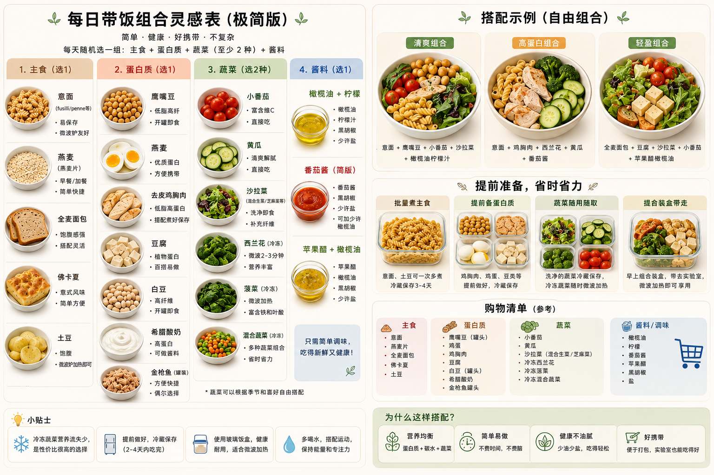
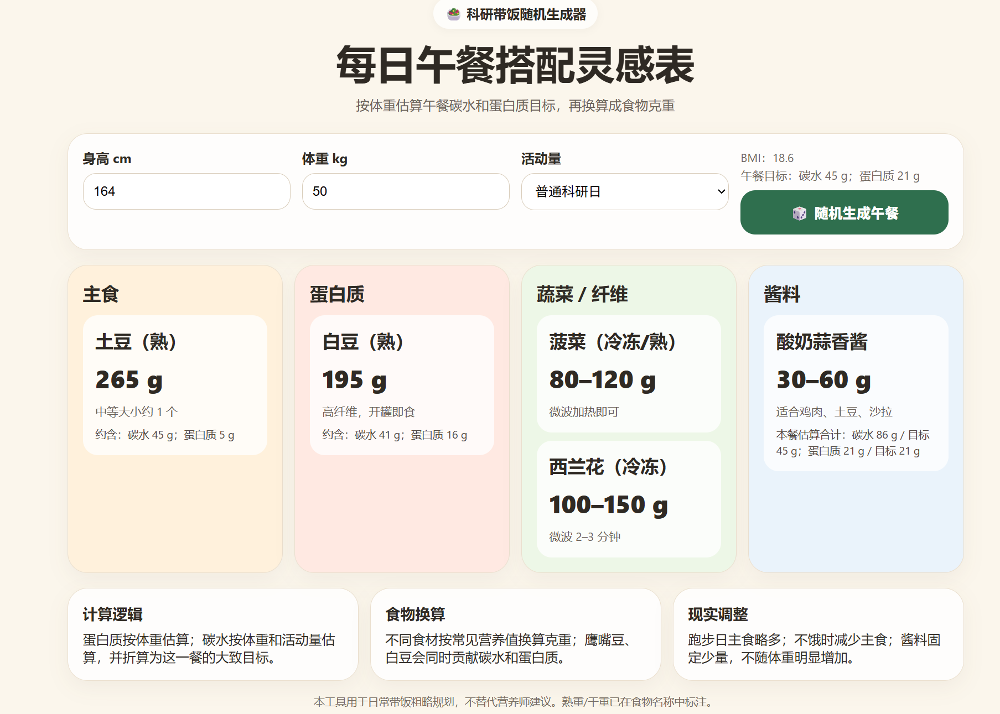
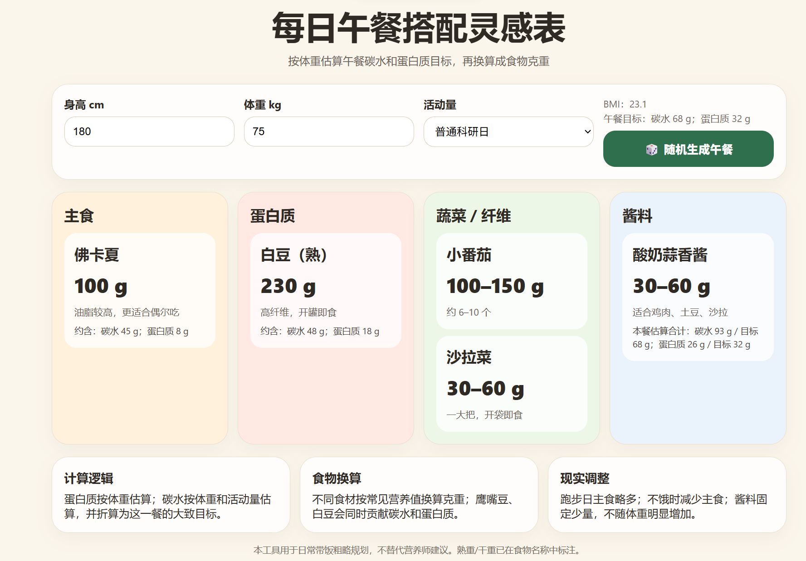

# Researcher Lunch Randomizer 🥗

一个给科研人 / 学生 / 忙碌上班族做的午餐随机生成器。

A lightweight lunch randomizer designed for researchers, students, and busy people who are tired of deciding what to eat every day.

## Why I made this

夏天带饭的时候，我发现自己每天都在想：

* 今天中午吃什么？
* 会不会坏？
* 蛋白质够不够？
* 做起来会不会太麻烦？

于是做了这个小工具。

核心目标：

* 低决策疲劳
* 微波炉友好
* 意大利超市容易买到
* 不需要复杂做饭
* 尽量健康并且长期可坚持

## Features

* 🎲 随机生成午餐组合
* 📏 根据身高 / 体重 / 活动量推荐克重
* 🥗 简单健康搭配
* ❄️ 夏天带饭友好
* 🧠 Designed for low decision fatigue

## Tech

Single-file HTML app (no backend required).

Built as a small VibeCoding project.

## Live Demo

点击下面这个链接可以打开小程序界面，手机和电脑端都可以~

👉 [Open the Lunch Randomizer](https://zbamby.github.io/researcher-lunch-randomizer/) 
